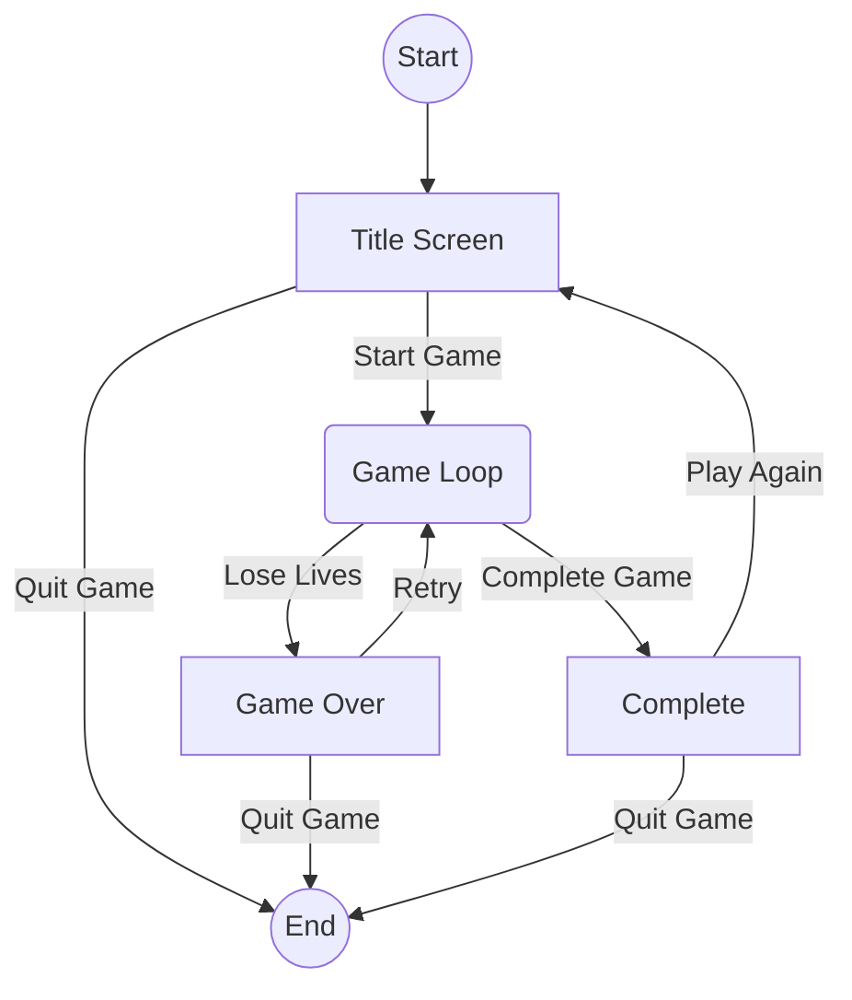

# Break Out Design Document

```mermaid
---
Title: Brickout GameState
---
flowchart TD

%% Entity List
A((Start)) 
%% index.html
B[Title Screen]
%% gameplay.html 
C(Game Loop)
%% gameover.html 
D[Game Over]
%% complete.html 
E[Complete]
F((End))

%% Flowchart
A --> B
B -->|Start Game| C
B -->|Quit Game| F
C -->|Lose Lives| D
C -->|Complete Game| E
D -->|Retry| C
D -->|Quit Game| F
E -->|Play Again| B
E -->|Quit Game| F
```